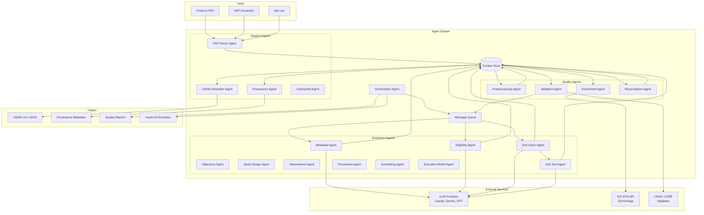

# AI Agent-Based Clinical Protocol Extraction System

**Document Type:** System Architecture Design  
**Project:** Protocol2USDM Agent System  
**Version:** 1.1  
**Date:** March 1, 2026  
**Status:** Architecture Design

---

## Executive Summary

This document presents the architecture for a novel AI agent-based system designed to extract clinical trial protocol data from PDF documents and transform it into CDISC USDM v4.0 format. The system leverages autonomous AI agents that collaborate to perform specialized extraction tasks, validate data quality, and produce standardized clinical trial definitions.

Unlike traditional monolithic extraction pipelines, this agent-based approach provides:
- **Modularity**: Independent agents with clear responsibilities
- **Scalability**: Parallel execution and distributed processing
- **Resilience**: Graceful degradation and automatic error recovery
- **Adaptability**: Self-correcting agents that improve over time
- **Observability**: Comprehensive monitoring and tracing

## Problem Statement

Clinical trial protocols are complex documents containing critical information about study design, eligibility criteria, procedures, and schedules. Extracting this information into structured, standardized formats (USDM v4.0) is:

1. **Labor-Intensive**: Manual extraction takes days or weeks per protocol
2. **Error-Prone**: Human extraction introduces inconsistencies and mistakes
3. **Non-Scalable**: Cannot handle large volumes of protocols efficiently
4. **Difficult to Maintain**: Changes to standards require extensive rework

### Solution Approach

Build an AI agent-based system where:
- Specialized agents extract specific domains (metadata, eligibility, schedules, etc.)
- Agents collaborate through a shared knowledge store
- Quality agents validate and enrich extracted data
- The system self-corrects through iterative refinement
- All outputs conform to CDISC USDM v4.0 standard

---

## System Architecture

### High-Level Overview

The system consists of four main component types:

1. **Orchestrator Agent**: Coordinates agent execution and manages workflows
2. **Extraction Agents** (14): Specialized agents for each domain
3. **Quality Agents** (4): Postprocessing, validation, enrichment, and reconciliation
4. **Support Agents** (4): PDF parsing, USDM generation, provenance tracking, checkpointing


### Architecture Diagram



---

## Core Components

### 1. Orchestrator Agent

**Purpose**: Central coordinator that manages the entire extraction workflow.

**Responsibilities**:
- Register and discover available agents
- Build execution plans based on agent dependencies
- Dispatch tasks to agents (sequential or parallel)
- Monitor execution progress
- Handle failures with retry logic
- Checkpoint progress for recovery
- Aggregate results into final output

**Key Capabilities**:
- Dependency graph construction
- Parallel execution scheduling
- Resource management
- Error recovery
- Progress tracking

### 2. Context Store

**Purpose**: Centralized knowledge repository shared by all agents.

**Features**:
- Entity storage with versioning
- Relationship tracking between entities
- Provenance metadata (source, confidence, timestamp)
- Transactional updates with rollback
- Concurrent read access
- Query by ID, type, or attributes
- JSON serialization for persistence

**Data Model**:
```python
ContextEntity:
  - id: unique identifier
  - entity_type: "epoch", "activity", "arm", etc.
  - data: entity attributes
  - provenance: source tracking
  - relationships: links to related entities
  - version: version number
  - timestamps: created_at, updated_at
```

### 3. Message Queue

**Purpose**: Asynchronous communication infrastructure for agent coordination.

**Features**:
- Priority-based message ordering
- Message persistence for recovery
- Dead-letter queue for failed messages
- Message filtering by type and capability
- Timeout handling with automatic retry

**Message Types**:
- REQUEST: Synchronous request for data or action
- RESPONSE: Reply to a request
- BROADCAST: Asynchronous notification to all agents
- ERROR: Error notification
- STATUS: Progress update


---

## Agent Types and Specifications

### Extraction Agents

Specialized agents that extract specific domain data from protocols.

#### 1. MetadataAgent

**Extracts**: Study identifiers, titles, sponsors, phase, indication

**Input**: Protocol PDF text, pages 1-10
**Output**: StudyTitle, StudyIdentifier, Organization, Indication entities
**Dependencies**: None (can run first)
**LLM Usage**: Text extraction with structured output
**Execution Time**: < 10 seconds

**Key Challenges**:
- Multiple sponsors and organizations
- Ambiguous study phases
- Missing or incomplete identifiers

#### 2. EligibilityAgent

**Extracts**: Inclusion and exclusion criteria

**Input**: Protocol PDF text, eligibility section
**Output**: EligibilityCriterion entities with categories
**Dependencies**: MetadataAgent (for study population context)
**LLM Usage**: Criterion extraction and categorization
**Execution Time**: < 15 seconds

**Key Challenges**:
- Nested logical criteria (AND/OR)
- Criterion categorization (age, gender, medical history)
- Linking criteria to study populations

#### 3. SoAVisionAgent

**Extracts**: Schedule of Activities table using vision-based approach

**Input**: Protocol PDF images, SoA pages
**Output**: Activity, Epoch, Encounter, ScheduledInstance entities with cell-level provenance
**Dependencies**: None (can run in parallel with MetadataAgent)
**LLM Usage**: Vision model (GPT-4.1, Claude Opus 4, Gemini 2.5 Pro) for table structure and cell content
**Execution Time**: < 60 seconds

**Extraction Methodology**:
1. **Table Detection**: Vision model identifies SoA table boundaries and structure
2. **Header Extraction**: Extract nested epoch/encounter headers with hierarchy
3. **Activity Extraction**: Extract activity names from leftmost column
4. **Cell Content Extraction**: For each cell, vision model extracts:
   - Tick marks (X, ✓, •) indicating activity occurrence
   - Numeric values (visit numbers, day ranges)
   - Text annotations (footnote references, special instructions)
5. **Footnote Linking**: Extract footnotes and link to referenced cells

**Cell-Level Provenance Tracking**:
Each extracted cell includes:
- `source`: "vision"
- `confidence_score`: Vision model confidence (0.0-1.0)
- `source_page`: Page number where cell appears
- `bounding_box`: Pixel coordinates of cell in image
- `model_used`: Specific vision model (e.g., "claude-opus-4-6")
- `extraction_timestamp`: When cell was extracted
- `cell_coordinates`: (row, column) position in table

**Key Challenges**:
- Complex table structures with nested headers
- Multi-page tables with continuation
- Tick mark detection and validation (multiple tick mark styles)
- Footnote extraction and linking
- Rotated or skewed tables
- Low-quality scans or images

#### 4. SoATextAgent

**Extracts**: Schedule of Activities table using text-based approach

**Input**: Protocol PDF text, SoA pages (text extraction)
**Output**: Activity, Epoch, Encounter, ScheduledInstance entities with cell-level provenance
**Dependencies**: SoAVisionAgent (uses vision-extracted headers for accurate text parsing)
**Wave**: 1
**LLM Usage**: Text model (Claude, Gemini) for structured table parsing
**Execution Time**: < 45 seconds

**Extraction Methodology**:
1. **Table Text Extraction**: Extract raw text from SoA pages using PDF parser
2. **Structure Detection**: LLM identifies table structure from text patterns:
   - Header rows (epochs, encounters, timepoints)
   - Activity rows with cell delimiters
   - Footnote sections
3. **Cell Parsing**: For each cell, text model extracts:
   - Tick mark indicators (X, x, ✓, •, or text like "Yes")
   - Numeric values and ranges
   - Text annotations
4. **Validation**: Cross-reference with table structure to ensure completeness

**Cell-Level Provenance Tracking**:
Each extracted cell includes:
- `source`: "text"
- `confidence_score`: Text model confidence (0.0-1.0)
- `source_page`: Page number where cell appears
- `text_position`: Character offset in extracted text
- `model_used`: Specific text model (e.g., "claude-opus-4-6")
- `extraction_timestamp`: When cell was extracted
- `cell_coordinates`: (row, column) position in table

**Key Challenges**:
- Ambiguous table structure in plain text
- Missing or inconsistent delimiters
- Multi-line cells with line breaks
- Footnote references embedded in text
- Table continuation across pages

**When to Use**:
- Vision extraction fails or has low confidence
- PDF has selectable text (not scanned image)
- Validation and cross-checking of vision results
- Fallback when vision model unavailable

#### 5. ObjectivesAgent

**Extracts**: Study objectives and endpoints

**Input**: Protocol PDF text, objectives section
**Output**: Objective, Endpoint, Estimand entities
**Dependencies**: MetadataAgent
**LLM Usage**: Objective extraction and classification
**Execution Time**: < 15 seconds

**Key Challenges**:
- Distinguishing primary, secondary, exploratory objectives
- Linking endpoints to objectives
- Extracting estimand components

#### 6. StudyDesignAgent

**Extracts**: Study arms, cohorts, and design structure

**Input**: Protocol PDF text, design section, Context Store (epochs from SoA)
**Output**: StudyArm, StudyCohort, StudyCell entities
**Dependencies**: SoAVisionAgent or SoATextAgent (for epoch context)
**LLM Usage**: Design structure extraction
**Execution Time**: < 20 seconds

**Key Challenges**:
- Complex randomization schemes
- Crossover and adaptive designs
- Linking arms to epochs and interventions

#### 7. InterventionsAgent

**Extracts**: Investigational products and dosing

**Input**: Protocol PDF text, intervention section
**Output**: StudyIntervention, AdministrableProduct, Substance entities
**Dependencies**: StudyDesignAgent (for arm context)
**LLM Usage**: Product and dosing extraction
**Execution Time**: < 15 seconds

**Key Challenges**:
- Multiple products and combinations
- Complex dosing regimens
- Linking products to arms and activities

#### 8. ProceduresAgent

**Extracts**: Clinical procedures and medical devices

**Input**: Protocol PDF text, procedures section, Context Store (activities from SoA)
**Output**: Procedure, MedicalDevice entities
**Dependencies**: SoAVisionAgent or SoATextAgent (for activity context)
**LLM Usage**: Procedure extraction and classification
**Execution Time**: < 20 seconds

**Key Challenges**:
- Linking procedures to activities
- Identifying medical devices
- Extracting procedure parameters

#### 9. SchedulingAgent

**Extracts**: Timing rules and scheduling logic

**Input**: Protocol PDF text, Context Store (activities, epochs)
**Output**: Timing, Condition, TransitionRule entities
**Dependencies**: SoAVisionAgent or SoATextAgent, ProceduresAgent
**LLM Usage**: Timing extraction and rule parsing
**Execution Time**: < 15 seconds

**Key Challenges**:
- Complex timing expressions (ISO 8601)
- Conditional scheduling rules
- Visit windows and tolerances

#### 10. ExecutionAgent

**Extracts**: Execution model semantics (time anchors, repetitions, state machine)

**Input**: Protocol PDF text, Context Store (full SoA structure)
**Output**: TimeAnchor, Repetition, StateMachine entities
**Dependencies**: SoAVisionAgent or SoATextAgent, SchedulingAgent
**LLM Usage**: Execution model extraction
**Execution Time**: < 25 seconds

**Key Challenges**:
- Identifying time anchors (visit vs event vs conceptual)
- Extracting cycle-based repetitions
- Building subject state machine

#### 11. NarrativeAgent

**Extracts**: Narrative structure and abbreviations

**Input**: Protocol PDF text, full document
**Output**: NarrativeContent, Abbreviation entities
**Dependencies**: None
**LLM Usage**: Structure extraction and abbreviation detection
**Execution Time**: < 10 seconds

#### 12. AdvancedAgent

**Extracts**: Advanced entities (amendments, geographic scope)

**Input**: Protocol PDF text, amendment history
**Output**: StudyAmendment, GeographicScope, Country entities
**Dependencies**: MetadataAgent
**LLM Usage**: Amendment and geography extraction
**Execution Time**: < 10 seconds

#### 13. DocStructureAgent

**Extracts**: Document structure and sections

**Input**: Protocol PDF text, table of contents
**Output**: NarrativeContentItem, StudyDefinitionDocument entities
**Dependencies**: None
**LLM Usage**: Structure extraction
**Execution Time**: < 10 seconds

#### 14. BiomedicalConceptAgent

**Extracts**: Biomedical concepts from SoA activities

**Input**: Context Store (activities from SoA extraction)
**Output**: BiomedicalConcept, BcCategory, BcSurrogate entities
**Dependencies**: SoAVisionAgent or SoATextAgent (for activity context)
**LLM Usage**: Concept extraction and classification
**Execution Time**: < 20 seconds

**Key Challenges**:
- Mapping activities to standardized biomedical concepts
- Categorizing concepts (efficacy, safety, PK, PD)
- Linking concepts to activities and procedures


### Quality Agents

Agents that validate, enrich, and reconcile extracted data.

#### 1. PostprocessingAgent

**Purpose**: Normalize extracted data and link related entities before validation

**Responsibilities**:
- Superscript and footnote normalization (strip footnote markers from activity names)
- Activity-group linking (associate activities with their parent groups)
- SoA data cleanup (normalize whitespace, fix encoding artifacts)
- Prepare data for downstream validation and reconciliation

**Input**: Context Store with raw extraction results
**Output**: Cleaned and normalized entities
**Dependencies**: All extraction agents
**Execution Time**: < 10 seconds

#### 2. ValidationAgent

**Purpose**: Validate extracted data against USDM v4.0 schema and CDISC CORE rules

**Responsibilities**:
- Schema validation (required fields, data types, cardinality)
- Entity reference validation (all IDs resolve)
- CDISC CORE conformance checking (9 rules including category validation)
- OpenAPI schema validation against USDM v4.0 spec
- Automatic fixes for common violations
- Validation report generation

**Input**: Complete Context Store
**Output**: Validation report, fixed entities
**Dependencies**: All extraction agents
**Execution Time**: < 30 seconds

**Validation Checks**:
- Required fields populated
- Data types correct
- Cardinality constraints satisfied
- Entity references valid
- CDISC CORE rules passed

#### 3. EnrichmentAgent

**Purpose**: Add terminology codes from NCI EVS API

**Responsibilities**:
- Identify entities requiring codes (indications, procedures, interventions)
- Query EVS API for matching NCI C-codes concurrently (ThreadPoolExecutor, max_concurrent=8)
- Rank and select best matching codes
- Thread-safe EVS response caching
- Track enrichment coverage with thread-safe metrics

**Input**: Context Store entities
**Output**: Enriched entities with Code objects
**Dependencies**: All extraction agents
**External API**: NCI EVS
**Execution Time**: < 5 seconds per entity

**Enrichment Targets**:
- Indications (diseases, conditions)
- Procedures (clinical procedures)
- Interventions (drugs, devices)
- Medical devices

#### 4. ReconciliationAgent

**Purpose**: Merge duplicate entities and resolve conflicts, including SoA vision vs text reconciliation

**Responsibilities**:
- Identify duplicate entities (same name, different IDs)
- Merge duplicates using priority rules
- Reconcile SoA entities from vision and text sources
- Clean entity names (remove footnotes, normalize whitespace)
- Update entity references after reconciliation
- Generate reconciliation reports with conflict details

**Input**: Context Store with potential duplicates
**Output**: Reconciled Context Store
**Dependencies**: All extraction agents
**Execution Time**: < 20 seconds

**Reconciliation Rules**:
- Execution model entities > Procedures > SoA Vision > SoA Text
- Higher confidence scores preferred
- More complete entities preferred
- Preserve source attribution from all sources

**SoA-Specific Reconciliation Logic**:

When both SoAVisionAgent and SoATextAgent extract the same SoA table:

1. **Cell-Level Reconciliation**:
   - For each cell at position (row, col):
     - If both sources agree: Use vision result (higher fidelity), merge provenance
     - If sources conflict: 
       - Compare confidence scores
       - If confidence difference < 0.2: Flag for manual review
       - If confidence difference ≥ 0.2: Use higher confidence source
       - Log conflict details for quality reporting
   
2. **Provenance Merging**:
   ```python
   merged_provenance = {
       'entity_id': cell_id,
       'sources': [
           {
               'source': 'vision',
               'agent_id': 'soa_vision_agent',
               'confidence': 0.92,
               'value': 'X',
               'bounding_box': [100, 200, 120, 220]
           },
           {
               'source': 'text',
               'agent_id': 'soa_text_agent',
               'confidence': 0.88,
               'value': 'X',
               'text_position': 1234
           }
       ],
       'reconciliation_method': 'agreement' | 'confidence_based' | 'manual_review',
       'final_value': 'X',
       'final_confidence': 0.95,  # Boosted when sources agree
       'conflict_detected': False
   }
   ```

3. **Confidence Boosting**:
   - When vision and text agree: Boost confidence by 0.1 (max 1.0)
   - When sources conflict but reconciled: Reduce confidence by 0.15

4. **Conflict Resolution Strategy**:
   - **Tick Mark Conflicts**: Prefer presence over absence (if one source has a tick and the other is empty, the tick wins regardless of source)
   - **Numeric Value Conflicts**: Prefer higher confidence source
   - **Fallback**: Source priority (vision > text for SoA cells)

5. **Quality Metrics**:
   - Agreement rate: % of cells where vision and text agree
   - Conflict rate: % of cells requiring reconciliation
   - Manual review rate: % of cells flagged for human review
   - Confidence boost rate: % of cells with boosted confidence

**Reconciliation Report**:
- Total cells extracted by each source
- Agreement rate and conflict rate
- List of conflicts with resolution method
- Cells flagged for manual review
- Confidence distribution before/after reconciliation

### Support Agents

Agents that provide infrastructure services.

#### 1. PDFParserAgent

**Purpose**: Extract text and images from PDF documents

**Responsibilities**:
- Extract text from specified pages
- Extract images for vision analysis
- Detect table regions
- Provide page-level text extraction

**Input**: PDF file path, page numbers
**Output**: Text content, image files
**Dependencies**: None
**Execution Time**: < 5 seconds per page

#### 2. USDMGeneratorAgent

**Purpose**: Combine Context Store into USDM v4.0 JSON

**Responsibilities**:
- Query Context Store for all entities
- Build USDM hierarchy (Study → StudyVersion → StudyDesign)
- Place entities at correct locations per USDM schema
- Validate output structure
- Generate final USDM JSON

**Input**: Complete Context Store
**Output**: USDM v4.0 JSON file
**Dependencies**: All extraction and quality agents
**Execution Time**: < 10 seconds

#### 3. ProvenanceAgent

**Purpose**: Track data lineage and confidence with cell-level granularity

**Responsibilities**:
- Generate provenance metadata for all entities
- Link provenance to USDM entity IDs
- Track source (vision, text, both) with cell-level detail
- Track confidence scores per cell
- Generate provenance JSON for web UI
- Support provenance queries for debugging and auditing

**Input**: Context Store with provenance
**Output**: Provenance JSON file
**Dependencies**: All extraction agents
**Execution Time**: < 5 seconds

**Cell-Level Provenance Methodology**:

For SoA table cells, provenance tracks:

1. **Source Attribution**:
   ```python
   cell_provenance = {
       'cell_id': 'activity_123_epoch_456_cell',
       'entity_type': 'ScheduledInstance',
       'cell_coordinates': {'row': 5, 'column': 3},
       'activity_id': 'activity_123',
       'epoch_id': 'epoch_456',
       'value': 'X',  # Tick mark or value
       'sources': [
           {
               'source_type': 'vision',
               'agent_id': 'soa_vision_agent',
               'confidence': 0.92,
               'source_page': 15,
               'bounding_box': {'x1': 100, 'y1': 200, 'x2': 120, 'y2': 220},
               'model_used': 'claude-opus-4-6',
               'extraction_timestamp': '2026-02-27T10:30:00Z'
           },
           {
               'source_type': 'text',
               'agent_id': 'soa_text_agent',
               'confidence': 0.88,
               'source_page': 15,
               'text_position': {'start': 1234, 'end': 1235},
               'model_used': 'claude-opus-4-6',
               'extraction_timestamp': '2026-02-27T10:30:15Z'
           }
       ],
       'reconciliation': {
           'method': 'agreement',  # or 'confidence_based', 'manual_review'
           'final_confidence': 0.95,
           'conflict_detected': False,
           'agreement': True
       }
   }
   ```

2. **Confidence Calculation**:
   - **Single Source**: Use model's raw confidence score
   - **Multiple Sources (Agreement)**: `min(1.0, max(confidences) + 0.1)`
   - **Multiple Sources (Conflict)**: `max(confidences) - 0.15`

3. **Provenance Aggregation**:
   - Activity-level: Aggregate cell provenance for all cells in activity row
   - Epoch-level: Aggregate cell provenance for all cells in epoch column
   - Table-level: Overall extraction quality metrics

4. **Provenance Queries**:
   - Get all cells from specific source (vision or text)
   - Get all cells with confidence below threshold
   - Get all cells with conflicts
   - Get all cells requiring manual review
   - Get provenance for specific USDM entity

5. **Web UI Integration**:
   - Display source badges (Vision, Text, Both) per cell
   - Show confidence scores on hover
   - Highlight conflicts in red
   - Show bounding boxes when clicking vision-sourced cells
   - Link to source page in PDF viewer

#### 4. CheckpointAgent

**Purpose**: Save and restore pipeline execution state for recovery

**Responsibilities**:
- Create checkpoints after each wave completes
- Store execution state and Context Store snapshot
- Support recovery from last checkpoint on failure
- Manage checkpoint file lifecycle

**Input**: Pipeline execution state, Context Store
**Output**: Checkpoint files
**Dependencies**: Orchestrator
**Execution Time**: < 2 seconds

---

## Agent Communication Patterns

### 1. Request-Response (Synchronous)

Used for direct queries between agents.

```
Agent A → REQUEST → Agent B
Agent B → RESPONSE → Agent A
```

**Use Cases**:
- Validation requests
- Enrichment lookups
- Dependency queries

### 2. Broadcast (Asynchronous)

Used for status updates and notifications.

```
Agent A → BROADCAST → All Agents
```

**Use Cases**:
- Completion notifications
- Context Store updates
- Error alerts

### 3. Task Dispatch (Orchestrator Pattern)

Used for task assignment and progress tracking.

```
Orchestrator → REQUEST → Agent
Agent → STATUS → Orchestrator (periodic)
Agent → RESPONSE → Orchestrator (completion)
```

**Use Cases**:
- Extraction task assignment
- Progress monitoring
- Result collection

### 4. Collaborative Refinement

Used for iterative quality improvement.

```
ExtractionAgent → REQUEST → ValidationAgent
ValidationAgent → RESPONSE (errors) → ExtractionAgent
ExtractionAgent → REQUEST (retry) → LLM
ExtractionAgent → RESPONSE (refined) → ValidationAgent
```

**Use Cases**:
- Error correction
- Quality improvement
- Confidence boosting


---

## Execution Workflows

### Workflow 1: Simple Protocol Extraction

**Scenario**: Extract metadata and eligibility from a simple protocol

**Steps**:
1. Orchestrator receives protocol PDF
2. PDFParserAgent extracts text from pages 1-20
3. MetadataAgent extracts study metadata
4. EligibilityAgent extracts eligibility criteria
5. ValidationAgent validates extracted data
6. USDMGeneratorAgent creates USDM JSON
7. ProvenanceAgent generates provenance metadata

**Execution Time**: < 2 minutes
**Agents Used**: 7 (2 extraction + 2 quality + 3 support)
**Parallel Opportunities**: None (sequential dependencies)

### Workflow 2: Complete Protocol with SoA

**Scenario**: Extract all data from a complete protocol with Schedule of Activities

**Steps**:
1. Orchestrator receives protocol PDF
2. PDFParserAgent extracts text and images
3. **Wave 0 (Parallel)**:
   - MetadataAgent extracts metadata
   - SoAVisionAgent extracts SoA table from images
   - NarrativeAgent extracts narrative
   - DocStructureAgent extracts document structure
4. **Wave 1 (Parallel)**:
   - SoATextAgent extracts SoA table from text (uses vision headers)
   - EligibilityAgent extracts eligibility
   - ObjectivesAgent extracts objectives
   - StudyDesignAgent extracts study design
   - AdvancedAgent extracts amendments and geography
5. **Wave 2 (Parallel)**:
   - InterventionsAgent extracts interventions
   - ProceduresAgent extracts procedures
6. **Wave 3 (Parallel)**:
   - BiomedicalConceptAgent generates biomedical concepts from activities
   - SchedulingAgent extracts timing
   - ExecutionAgent extracts execution model
7. **Wave 4 (Parallel)**:
   - PostprocessingAgent normalizes footnotes, links activity groups
   - ReconciliationAgent reconciles duplicates and SoA vision/text conflicts
   - ValidationAgent validates data (CDISC CORE rules, schema checks)
   - EnrichmentAgent enriches with NCI EVS codes (concurrent API calls)
8. **Wave 5 (Parallel)**:
   - USDMGeneratorAgent creates USDM JSON
   - ProvenanceAgent generates provenance with cell-level detail
9. Pipeline generates `result.md` summary with execution flow, agent results, and output file listing

**Execution Time**: < 5 minutes
**Agents Used**: 21 (14 extraction + 4 quality + 3 support)
**Parallel Opportunities**: 6 waves (0-5) with 2-5 agents each

**Output Directory Structure**:
Each run produces a timestamped directory containing numbered output files:
```
output/YYYYMMDD_HHMMSS/
├── 01_extraction_metadata.json
├── 02_extraction_soa_vision.json
├── 03_extraction_soa_text.json
├── 04_extraction_narrative.json
├── 05_extraction_document_structure.json
├── 06_extraction_eligibility.json
├── 07_extraction_objectives.json
├── 08_extraction_study_design.json
├── 09_extraction_procedures_devices.json
├── 10_extraction_interventions.json
├── 11_extraction_scheduling_logic.json
├── 12_extraction_execution_model.json
├── 13_extraction_advanced_entities.json
├── 14_quality_postprocessing.json
├── 15_quality_reconciliation.json
├── 16_quality_validation.json
├── 17_quality_enrichment.json
├── 18_support_usdm_generator.json (USDM v4.0)
├── 19_support_provenance.json
└── result.md
```

**SoA Reconciliation Flow**:
- Wave 0: SoAVisionAgent extracts headers/structure from images
- Wave 1: SoATextAgent uses vision headers to extract activity data from text
- Wave 4: ReconciliationAgent merges results, resolves conflicts, boosts confidence
- Wave 5: ProvenanceAgent generates cell-level provenance showing both sources

### Workflow 3: Batch Processing

**Scenario**: Process 100 protocols in parallel

**Steps**:
1. Orchestrator receives 100 protocol PDFs
2. Create 100 execution plans (one per protocol)
3. Execute plans in parallel with resource limits
4. Collect results as they complete
5. Generate batch summary report

**Execution Time**: < 2 hours (with 10 parallel workers)
**Agents Used**: All agents × 10 instances
**Parallel Opportunities**: 100 protocols, 10 concurrent

---

## Data Models

### Agent Interface

```python
class BaseAgent(ABC):
    """Base interface for all agents"""
    
    def __init__(self, agent_id: str, config: Dict[str, Any]):
        self.agent_id = agent_id
        self.config = config
        self.state = AgentState.INITIALIZING
        self.metrics = AgentMetrics()
        self.context_store = None
        self.message_queue = None
    
    @abstractmethod
    def initialize(self) -> None:
        """Initialize agent resources"""
        pass
    
    @abstractmethod
    def execute(self, task: AgentTask) -> AgentResult:
        """Execute assigned task"""
        pass
    
    @abstractmethod
    def terminate(self) -> None:
        """Clean up agent resources"""
        pass
    
    @abstractmethod
    def get_capabilities(self) -> AgentCapabilities:
        """Return agent capabilities"""
        pass
```

### Agent Capabilities

```python
@dataclass
class AgentCapabilities:
    """Declares what an agent can process and produce"""
    agent_type: str
    input_types: List[str]  # e.g., ["pdf", "context_data"]
    output_types: List[str]  # e.g., ["metadata", "eligibility"]
    dependencies: List[str]  # Agent IDs this agent depends on
    supports_parallel: bool = True
    max_retries: int = 3
    timeout_seconds: int = 300
```

### Context Entity

```python
@dataclass
class ContextEntity:
    """Entity stored in Context Store"""
    id: str
    entity_type: str  # e.g., "epoch", "activity", "arm"
    data: Dict[str, Any]
    provenance: EntityProvenance
    relationships: Dict[str, List[str]]
    version: int = 1
    created_at: datetime
    updated_at: datetime
```

### Entity Provenance

```python
@dataclass
class EntityProvenance:
    """Tracks source and confidence of extracted data"""
    entity_id: str
    source_agent_id: str
    extraction_timestamp: datetime
    confidence_score: float  # [0.0, 1.0]
    source_pages: List[int]
    model_used: str
    version: int = 1
```

### Agent Task

```python
@dataclass
class AgentTask:
    """Task assigned to an agent"""
    task_id: str
    agent_id: str
    task_type: str
    input_data: Dict[str, Any]
    dependencies: List[str]  # Task IDs that must complete first
    priority: Priority
    timeout_seconds: int
    retry_count: int = 0
    max_retries: int = 3
```

### Agent Result

```python
@dataclass
class AgentResult:
    """Result from agent execution"""
    task_id: str
    agent_id: str
    success: bool
    data: Optional[Dict[str, Any]] = None
    error: Optional[str] = None
    confidence_score: Optional[float] = None
    execution_time_ms: float = 0.0
    tokens_used: int = 0
    api_calls: int = 0
```

---

## Error Handling and Recovery

### Error Classification

**Transient Errors** (retry with exponential backoff):
- Network timeouts
- API rate limits
- Temporary resource unavailability
- LLM service interruptions

**Permanent Errors** (mark as failed, continue):
- Invalid PDF format
- Missing required data
- Schema validation failures
- Authentication failures

**Configuration Errors** (report at startup):
- Invalid agent configuration
- Missing API credentials
- Incorrect model specifications

### Retry Strategy

- Transient errors: 3 retries with exponential backoff (1s, 2s, 4s)
- API failures: 5 retries
- Network timeouts: 2 retries with linear backoff

### Checkpoint and Recovery

**Checkpoint Strategy**:
- Create checkpoint after each wave completes
- Store execution state and Context Store snapshot
- Files named `checkpoint_{execution_id}_{wave_number}.json`

**Recovery Process**:
1. Load checkpoint file
2. Restore Context Store from snapshot
3. Identify completed tasks
4. Resume from next wave
5. Skip completed agents
6. Retry failed agents

### Graceful Degradation

When agents fail:
- Isolate failure to individual agent
- Generate partial USDM output with available data
- Use defaults for missing fields
- Add quality indicators to output
- Generate error reports with remediation suggestions


---

## Performance and Scalability

### Performance Targets

**Individual Agent Performance**:
- Execution time: < 30 seconds per agent
- Memory usage: < 2GB per agent
- API calls: < 10 calls per extraction
- Token usage: < 10K tokens per extraction

**System Performance**:
- Simple protocol: < 2 minutes
- Complex protocol: < 5 minutes
- Batch (100 protocols): < 2 hours with 10 workers
- Context Store query: < 10ms
- Message delivery: < 100ms

### Scalability Strategies

**Horizontal Scaling**:
- Run multiple agent instances in parallel
- Distribute agents across multiple machines
- Load balance tasks across agent instances
- Share Context Store via network

**Vertical Scaling**:
- Increase agent resource limits (CPU, memory)
- Use faster LLM models
- Optimize Context Store queries
- Cache frequently accessed data

**Resource Management**:
- Implement resource limits per agent
- Monitor resource usage in real-time
- Implement backpressure mechanisms
- Queue tasks when resources exhausted

### Parallel Execution

**Dependency Graph**:
```
Wave 0: PDFParserAgent, MetadataAgent, SoAVisionAgent, NarrativeAgent, DocStructureAgent (parallel)
Wave 1: SoATextAgent, EligibilityAgent, ObjectivesAgent, StudyDesignAgent, AdvancedAgent (parallel)
Wave 2: InterventionsAgent, ProceduresAgent (parallel)
Wave 3: BiomedicalConceptAgent, SchedulingAgent, ExecutionAgent (parallel)
Wave 4: PostprocessingAgent, ReconciliationAgent, ValidationAgent, EnrichmentAgent (parallel)
Wave 5: USDMGeneratorAgent, ProvenanceAgent (parallel)
```

**Parallelization Benefits**:
- Wave 0: 5x speedup (metadata + soa_vision + narrative + docstructure parallel)
- Wave 1: 5x speedup (soa_text + eligibility + objectives + studydesign + advanced)
- Wave 2: 2x speedup
- Wave 3: 2x speedup
- Wave 4: 4x speedup (postprocessing + reconciliation + validation + enrichment)
- Wave 5: 2x speedup

**Total Speedup**: ~3-4x compared to sequential execution

**SoA Extraction Strategy**:
- SoAVisionAgent runs first (Wave 0) to extract header structure from images
- SoATextAgent runs in Wave 1, using vision headers for accurate text extraction
- ReconciliationAgent merges results in Wave 4
- If one agent fails, system continues with single source
- Confidence boosted when both sources agree

---

## Deployment Architecture

### Single-Node Deployment

**Use Case**: Development, small-scale testing

**Configuration**:
- All agents on one machine
- Shared Context Store (in-memory)
- Local message queue
- Local file system for output

**Hardware Requirements**:
- 16 CPU cores
- 32GB RAM
- 100GB storage
- 100 Mbps network

### Multi-Node Deployment

**Use Case**: Production, high throughput

**Configuration**:
- Orchestrator node (4 CPU, 8GB RAM)
- Extraction agent nodes (8 CPU, 16GB RAM each) × 3
- Quality agent node (4 CPU, 8GB RAM)
- Shared Context Store (Redis or PostgreSQL)
- Distributed message queue (RabbitMQ or Kafka)
- Shared file system (NFS or S3)

**Hardware Requirements**:
- 5 servers total
- 100 Mbps inter-node network
- 50 Mbps external API network
- < 10ms inter-node latency

### Containerized Deployment

**Use Case**: Cloud deployment, auto-scaling

**Configuration**:
- Docker containers for each agent type
- Kubernetes for orchestration
- Redis for Context Store
- RabbitMQ for message queue
- S3 for file storage

**Kubernetes Resources**:
- Orchestrator: 1 pod (4 CPU, 8GB RAM)
- Extraction agents: 3-10 pods (8 CPU, 16GB RAM each)
- Quality agents: 1 pod (4 CPU, 8GB RAM)
- Support agents: 1 pod (4 CPU, 8GB RAM)

---

## Security and Compliance

### Data Security

**Encryption**:
- Encrypt inter-agent messages containing sensitive data
- Encrypt Context Store at rest
- Use TLS for all external API calls
- Encrypt checkpoint files

**Access Control**:
- Authenticate agents before Context Store access
- Role-based access control for agent capabilities
- Audit all data access and modifications
- Sanitize PII from logs and error messages

**API Security**:
- Secure credential management for external APIs
- Rotate API keys regularly
- Implement rate limiting
- Validate input data to prevent injection attacks

### Compliance

**HIPAA Compliance**:
- Encrypt PHI at rest and in transit
- Audit all PHI access
- Implement data retention policies
- Provide data breach notification

**GDPR Compliance**:
- Support data deletion requests
- Provide data export functionality
- Document data processing activities
- Implement privacy by design

**21 CFR Part 11 Compliance**:
- Electronic signatures for data modifications
- Audit trails for all changes
- Data integrity controls
- System validation documentation

---

## Monitoring and Observability

### Metrics Collection

**Agent Metrics**:
- Execution count, success count, failure count
- Execution time (mean, median, p95, p99)
- Confidence scores
- Token usage, API calls
- Memory usage, CPU usage

**System Metrics**:
- Total execution time per protocol
- Agent utilization (% time active)
- Parallelization efficiency
- Context Store query performance
- Message queue latency

**Quality Metrics**:
- USDM validation pass rate
- CDISC CORE conformance rate
- Enrichment coverage
- Provenance completeness

### Logging

**Structured Logging**:
- JSON format for all logs
- Correlation IDs for request tracing
- Log levels (DEBUG, INFO, WARN, ERROR)
- Agent-specific logging contexts

**Log Aggregation**:
- Centralized log collection (ELK stack, Splunk)
- Real-time log streaming
- Log retention policies
- Log search and analysis

### Alerting

**Alert Conditions**:
- Agent failure rate > 5%
- Execution time > 3x baseline
- Memory usage > 90%
- API error rate > 10%
- USDM validation failure rate > 5%

**Alert Channels**:
- Email notifications
- Slack/Teams messages
- PagerDuty for critical alerts
- Dashboard indicators

### Dashboards

**Real-Time Dashboard**:
- Active agents and their status
- Current execution progress
- Resource usage graphs
- Error rate trends
- Queue depths

**Historical Dashboard**:
- Execution time trends
- Success/failure rates over time
- Quality metrics trends
- Cost analysis (API usage)
- Capacity planning

---

## Technology Stack

### Core Technologies

**Programming Language**: Python 3.9+
**Agent Framework**: Custom (based on BaseAgent interface)
**Message Queue**: In-memory priority queue
**Context Store**: In-memory (ContextStore class)
**File Storage**: Local filesystem

### External Services

**LLM Providers**:
- OpenAI (GPT-4o, GPT-5.x)
- Anthropic (Claude Opus 4.6/4.5, Claude Sonnet 4)
- Google (Gemini 2.5 Pro/Flash, Gemini 3 Flash)

**Terminology Services**:
- NCI EVS API (terminology enrichment)

**Validation Services**:
- CDISC CORE Engine (conformance validation)
- USDM Python Package (schema validation)

### Development Tools

**Testing**: pytest
**Containerization**: Docker (optional)

---

## Development Roadmap

### Phase 1: Foundation (Weeks 1-2)

**Deliverables**:
- BaseAgent interface implementation
- Agent registry
- Context Store implementation
- Message Queue implementation
- Orchestrator basic functionality

**Validation**:
- Register mock agents
- Query Context Store
- Send/receive messages
- Create simple execution plans

### Phase 2: Core Extraction Agents (Weeks 3-6)

**Deliverables**:
- MetadataAgent
- EligibilityAgent
- SoAVisionAgent
- SoATextAgent
- ObjectivesAgent
- StudyDesignAgent
- InterventionsAgent

**Validation**:
- Unit tests for each agent
- Integration tests for agent workflows
- SoA reconciliation testing (vision vs text)
- Performance benchmarks
- Golden file comparisons

### Phase 3: Additional Extraction Agents (Weeks 7-8)

**Deliverables**:
- ProceduresAgent
- SchedulingAgent
- ExecutionAgent
- NarrativeAgent
- AdvancedAgent
- DocStructureAgent

**Validation**:
- Complete test coverage
- End-to-end workflow tests
- Performance optimization

### Phase 4: Quality Agents (Weeks 9-10)

**Deliverables**:
- ValidationAgent
- EnrichmentAgent
- ReconciliationAgent (with SoA vision/text merging logic)

**Validation**:
- Validation accuracy tests
- Enrichment coverage tests
- Reconciliation correctness tests
- SoA conflict resolution testing

**Validation**:
- Validation accuracy tests
- Enrichment coverage tests
- Reconciliation correctness tests

### Phase 5: Support Agents (Weeks 11-12)

**Deliverables**:
- PDFParserAgent
- USDMGeneratorAgent
- ProvenanceAgent
- Checkpoint/recovery system
- Error handling framework

**Validation**:
- PDF parsing accuracy
- USDM generation correctness
- Provenance completeness
- Recovery testing

### Phase 6: Integration and Testing (Weeks 13-14)

**Deliverables**:
- Complete system integration
- End-to-end testing
- Performance testing
- Resilience testing

**Validation**:
- 100 protocol test suite
- Performance benchmarks met
- Error recovery validated
- Documentation complete

### Phase 7: Production Deployment (Weeks 15-16)

**Deliverables**:
- Production deployment
- Monitoring and alerting
- User documentation
- Training materials

**Validation**:
- Production smoke tests
- Monitoring dashboards operational
- User acceptance testing
- Stakeholder sign-off

---

## Conclusion

This AI agent-based architecture provides a modern, scalable approach to clinical protocol extraction. The system's modular design enables:

- **Independent Development**: Each agent can be developed and tested in isolation
- **Parallel Execution**: Multiple agents can run concurrently for faster processing
- **Graceful Degradation**: System continues with partial results when agents fail
- **Self-Correction**: Agents collaborate to validate and improve extraction quality
- **Extensibility**: New agents can be added without modifying existing code
- **Observability**: Comprehensive monitoring and tracing for debugging and optimization

The architecture is designed to produce CDISC USDM v4.0 compliant outputs while maintaining high extraction accuracy, performance, and reliability.

---

**Document Control:**
- Version: 1.1
- Last Updated: March 1, 2026
- Next Review: April 1, 2026
- Owner: Protocol2USDM Development Team
- Related Documents: docs/extraction-pipeline.md, docs/developer-guide.md
